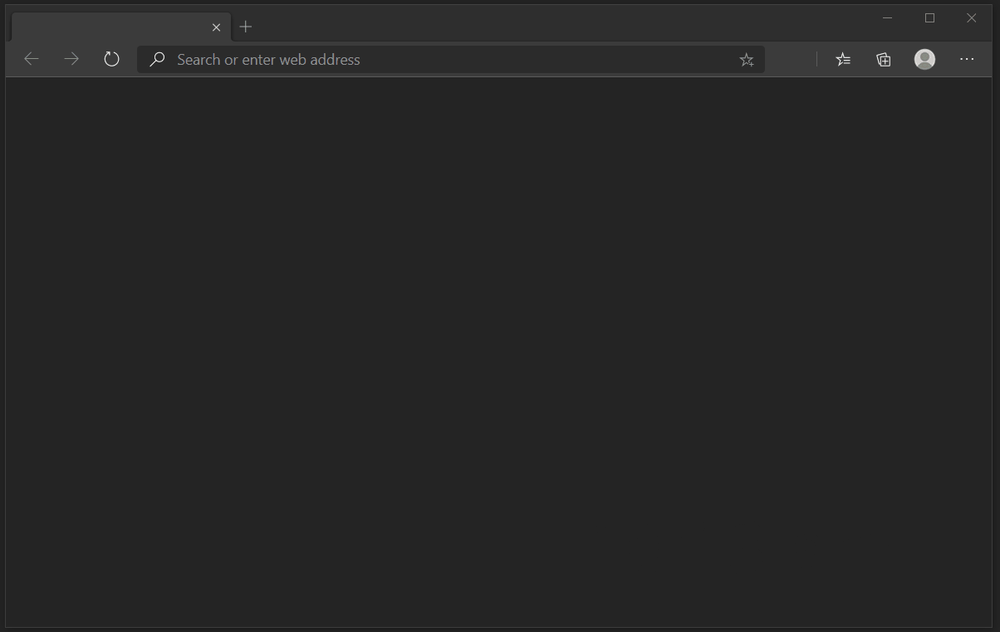

# Concentrate

Reading a lot or studying a bit?

From a safe way to fight interruptions and distractions into a surprisingly helpful app for concentration.

I really hope it also helps your studies and peace of mind.

### Features

- Removes Flashy Ad Banners and Animated Images
- Removes Social Media Links and Comments
- YouTube Video Ads - Auto Skips or Mutes before Ad playback
- Low Brightness Dark-Mode NewTab with Hidden Clock Timer
- Speed Adjustable AutoScroll with Keyboard Shortcuts for Reading
- FullScreen by Click and DoubleClick
- Auto Mute - CNN and anything new that comes up

A Modern Add-on for a Quiet and Focused Browsing Experience.

## Installation - Not yet updated

[Get for Chrome](https://chrome.google.com/webstore/detail/goecnaonchbggnbifdlgcdflabaiilpj)

[Get for Edge](https://microsoftedge.microsoft.com/addons/detail/mmlolmfkhnilblibmnalmkinojfpcckh)

This addon is forever free of charge with no interest in data collection or selling.

[Privacy](PRIVACY.TXT)

---

https://github.com/ruyd/Concentrate
