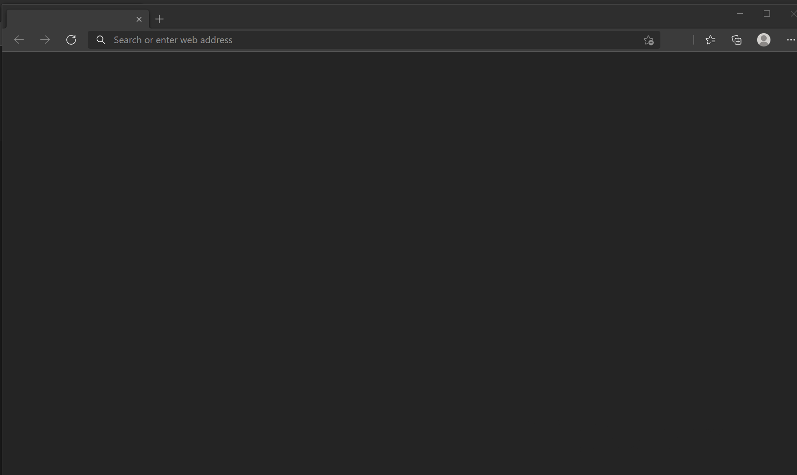
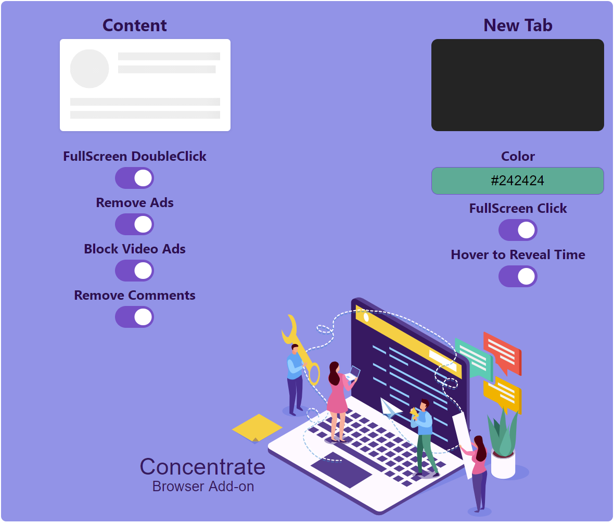

# Concentrate

A Modern Add-on for a Quiet and Focused Browsing Experience

## Installation

[Get now for Chrome](https://chrome.google.com/webstore/detail/goecnaonchbggnbifdlgcdflabaiilpj)

[Get now for Edge](https://microsoftedge.microsoft.com/addons/detail/mmlolmfkhnilblibmnalmkinojfpcckh)

### Features

- Removes Flashy Advertising
- Removes Social Media Links and Comments
- FullScreen by Click and DoubleClick
- Blocks YouTube Video Ads - Auto Skips or Mutes before Ad playback
- Speed Reversible AutoScroll with Keyboard Shortcuts
- Auto Mute for CNN's bang and anything new that comes up
- Low Brightness Dark-Mode NewTab with Hidden Clock Timer

_This addon is forever free of charge with no interest in data collection or selling. Not everyone wants or should have to pay to learn without advertising. I really hope it helps your studies and peace of mind._

[Privacy](PRIVACY.TXT)

---

https://github.com/ruyd/Concentrate
