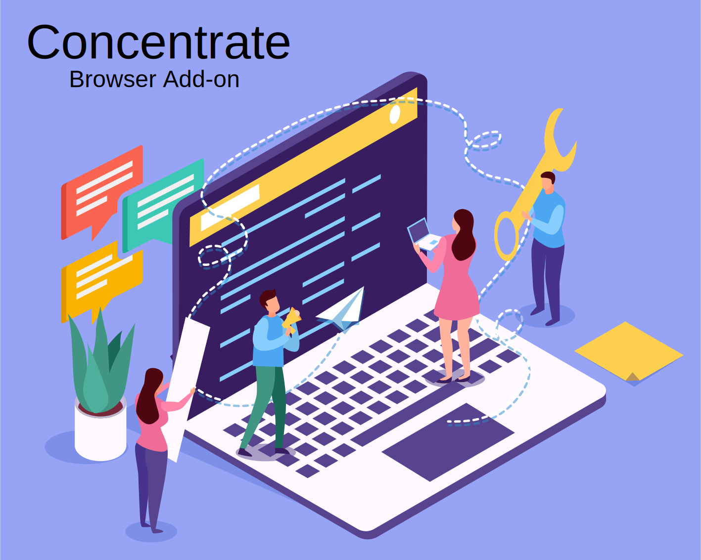

# Concentrate

Reading a lot and or studying a bit on YouTube without Premium?

Me too but it's incredibly hard with all the advertising desperately competing for your attention.

Out of necessity, this add-on was born, I really hope it helps your studies and peace of mind.

### Features

- Removes Flashy Ad Banners and Animated Images
- Removes Social Media Links and Comments
- YouTube Ad Defender - Auto Skips or Mutes before Ad playback
- Low Brightness Dark-Mode NewTab with Hidden Links and Clock
- Speed Adjustable AutoScroll with Keyboard Shortcuts for Reading
- FullScreen by Click and DoubleClick

A modern add-on for a quiet and focused browsing experience.

This addon is forever free of charge with no interest in data collection or selling.
[Privacy](PRIVACY.TXT)
